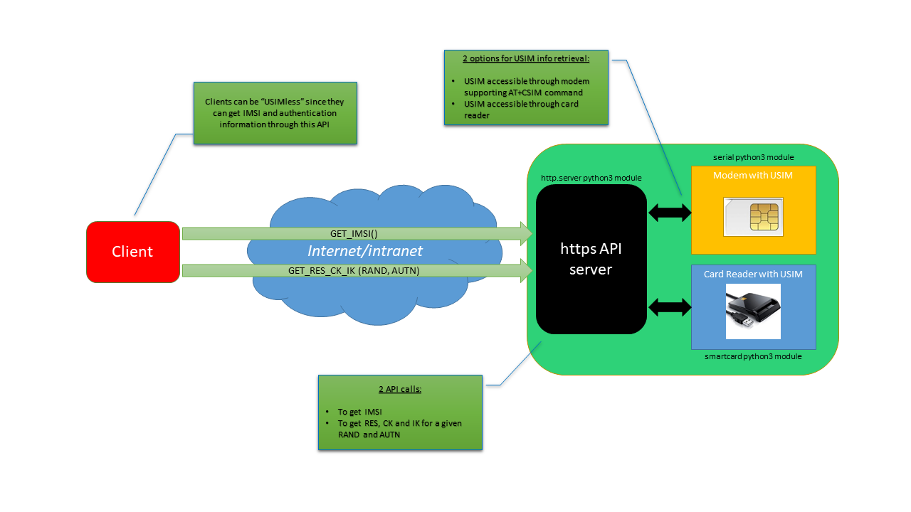

# USIM https server API for AKA authentication

This is just a basic https server with an API that exposes IMSI, and AKA algorithm to external clients needing that information.

This allow a remote client to be "USIMless", and retrieve IMSI, and RES, CK and IK remotely.

This is just an example without any authentication/authorization mechanism, but can be easily adapted to support it.

Some applications that I've done that need a dongle or a smartcard reader (eNB, SWu emulator, GBA, etc...), can be adapted to retrieve authentication information through this web service.

I can imagine a usecase: this service running in my Raspberry Pi with a smartcard reader connected to it with my USIM datacard, and I, somewhere in the world with my laptop, using a wifi network to connect to my operator ePDG without any physical USIM card to activate a corporate APN.

The next picture sums it all:

<p align="center"></p>


So the API has two basic operations, and returns the information in json format:

- one to obtain the IMSI:
  
  Example:
  - https://<domain | IP address>/?type=imsi


```
 {
     "imsi": "123456789012345"
 }
```
- one to get the RES, CK and IK for a given RAND and AUTN:
  
  Example:
  - https://<domain | IP address>/?type=rand-autn&rand=D6BA0C396BCE3189EF8B49FAF3F67462&autn=B46F17E0F84F8000E6693AE37446963E

```
 {
     "res": "FCCB24ADFBA66882",
     "ck": "5AFF52E6AAC652024111C33D3F886786",
     "ik": "26D77E75251C7DA4BB5645367115E4A8"
 }
```

The application can communicate with the USIM through a modem supporting AT+CSIM command, or through a smartcard reader.

These are the application options:

```
root@ubuntu# python3 usim_https_server.py -h
Usage: usim_https_server.py [options]

Options:
  -h, --help            show this help message and exit
  -m MODEM, --modem=MODEM
                        modem port (i.e. COMX, or /dev/ttyUSBX)
  -r READER, --reader=READER
                        reader index (i.e. 0, 1, 2, etc... Default: 0)

```

The application needs a server.pem file for which a path must be specificed in the code.
I created my self-signed certificate using this command (example for a self signed certificate valid for 365 days):

```
openssl req -new -x509 -keyout server.pem -out server.pem -days 365 -nodes
```


